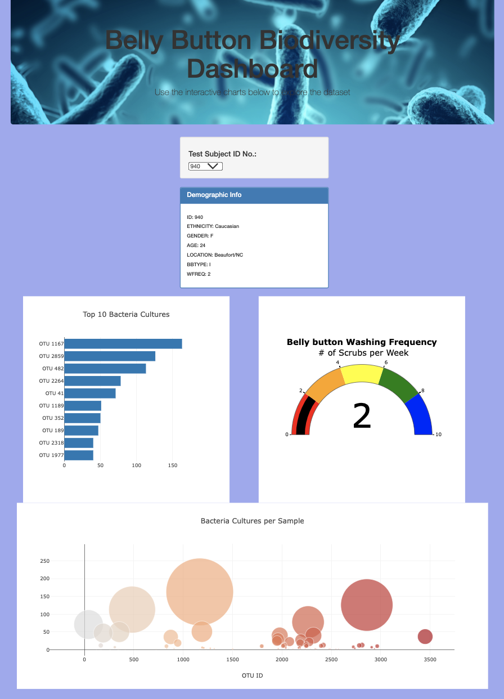

# Plotly Deploy

## Website

Interactive website for belly button biodiversity can be found here:
https://alberzitas.github.io/plotly_deploy/index.html

## Purpose and Overview

Rosa is engaged in a quest to identify and document bacterial species capable of synthesizing protein that mimics the taste of beef. In her pursuit, Rosa has collected bacterial samples from individuals worldwide, categorizing them by ID. To successfully accomplish this project, it is essential for Rosa to visualize the data associated with each volunteer. To achieve this objective, we employed JavaScript to present the sample data through interactive bar, bubble, and gauge graphs. This involved utilizing various JavaScript functions such as array.map(), filter(), and slice() to sort through and present the relevant data effectively. Furthermore, since the sample data was in JSON format, we utilized the d3.json library in conjunction with plotly to visualize the data.

## Analysis

Getting the page to display each graph correctly involved making sure that every variable was properly defined. Additionally, CORS errors had to be bypassed by running a static server on the terminal. In the end, the resulting graphs were interactive and responded to changes in the dropdown menu accordingly. Hovering the cursor above each bar or bubble brought up further information about the sample from the json file.

A screenshot of the completed page:

